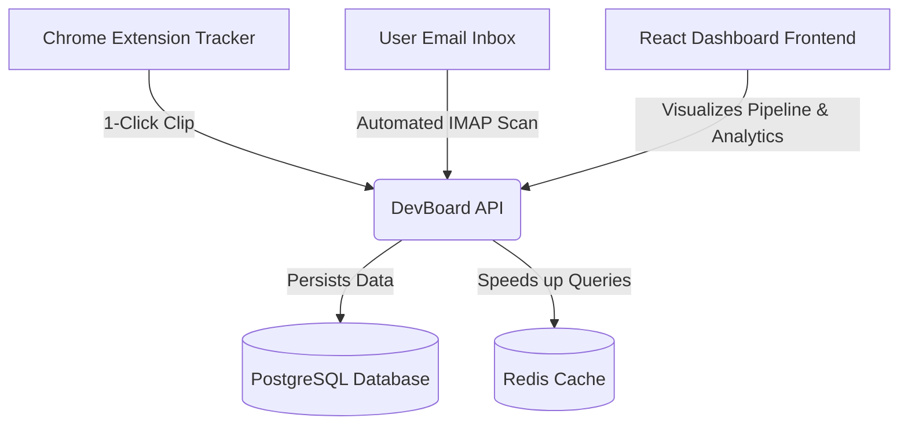

# DevBoard — Intelligent Job Application Tracker

DevBoard is a self-hosted, full-stack application pipeline tracker designed to organize, automate, and analyze your job search. It replaces cluttered spreadsheets with a streamlined Kanban board, automated email synchronization, and a custom Chrome extension for one-click tracking.

---

## Key Features

*   **Visual Tracking Pipeline**: Manage your job applications using an intuitive Kanban board representing every stage of your search: Applied, Phone Screen, Technical, Online Assessment (OA), Onsite, Offer, Rejected, and Ghosted.
*   **One-Click Chrome Extension (Tracker)**: Clip and track job openings directly from LinkedIn, Wellfound, Greenhouse, Lever, and other major job boards. The extension automatically infers the company, job role, and application URL.
*   **Automated Email Synchronization**: Securely connect your email inbox via IMAP to automatically sync application updates. DevBoard scans incoming confirmation, interview invitation, and decision emails, automatically transitioning job stages and appending status change logs.
*   **Dynamic Analytics Dashboard**: Gain insight into your application pipeline with live conversion rates, interview success metrics, and total tracking figures to keep you optimized.
*   **Performance Cache Integration**: Utilizes a Redis cache for sub-millisecond analytics loads and instantaneous user updates.

---

## System Architecture

DevBoard consists of three main components designed to interact seamlessly:



1.  **DevBoard API (Backend)**: Built with Express, TypeScript, and Prisma ORM. It manages user authentication, core CRUD logic, background cron jobs for email parsing, and Redis caching.
2.  **DevBoard Dashboard (Frontend)**: A modern, high-performance React application built using Vite and TailwindCSS/Vanilla CSS, displaying the Kanban pipeline and analytics charts.
3.  **DevBoard Tracker (Chrome Extension)**: A lightweight client built with TypeScript that intercepts job posting pages, infers job metadata, and clips them directly into the backend.

---

## Getting Started (Local Development)

### 1. Backend Server Setup
1.  Navigate to `DevBoard API`.
2.  Install dependencies:
    ```bash
    npm install
    ```
3.  Copy `.env.example` to `.env` and fill in your database connection string, Redis URL, JWT secret, and encryption key.
4.  Launch local services (Postgres & Redis) via Docker:
    ```bash
    docker-compose up -d
    ```
5.  Generate the Prisma schema client and push tables:
    ```bash
    npx prisma generate
    npx prisma db push
    ```
6.  Start the development server:
    ```bash
    npm run dev
    ```

### 2. Frontend Dashboard Setup
1.  Navigate to `DevBoard Dashboard`.
2.  Install dependencies:
    ```bash
    npm install
    ```
3.  Start the development server:
    ```bash
    npm run dev
    ```

### 3. Chrome Extension Setup
1.  Navigate to `DevBoard Tracker`.
2.  Install development dependencies:
    ```bash
    npm install
    ```
3.  Compile the extension script assets:
    ```bash
    npm run build
    ```
4.  Open Chrome and go to `chrome://extensions/`.
5.  Enable **Developer Mode** (top-right).
6.  Click **Load Unpacked** (top-left) and select the `DevBoard Tracker/dist` folder.

---

## Using DevBoard

### Automated Email Sync Setup
To enable automatic tracking via email scans:
1.  Open the **Email Settings** modal on your DevBoard Dashboard.
2.  Toggle **Enable Automated Email Sync** to active.
3.  Input your IMAP host, port, username, and password.
    *   *For Gmail/Outlook users, you must generate and input an **App Password** from your account security panel instead of your primary password.*
4.  The server's cron worker will run background scans periodically to keep your application statuses automatically up-to-date.
